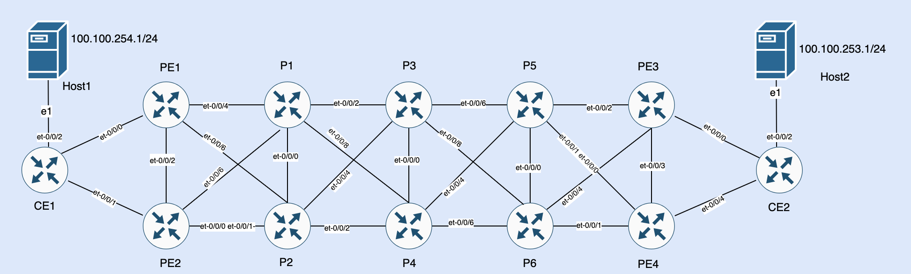

# MPLS-Backbone-Class-Of-Service-Design-Principles
Designing and deploying Class of Service in MPLS backbone network is a complex topic and explaining all the components would require lengthy document. However in this document I will try to explain high level design principles with implementation details for a simple use case. I will not discuss any of implementation details related to MPLS LSP but focus would be on Class of Service basic design principles. 
## Toplogy

## Platform Used
Junos  23.2R1.15-EVO on vPTX (ptx10001-36mr)
## Use Case
ICMP traffic between Host1 and Host2 should be give best-effort treatment while ssh traffic should be given assured-forwarding treatment.  I will explain config with respect Host1 to Host2 flows and reverse direction config will follow same scheme.
## Design Considerations
Traffic entering into Customer Edge (CE1) router will be classified by matching source address , protocols and destination port (for ssh traffic) and subsequently will be assigned to appropriate forwarding class. This type of classifier is called "Multifield Classifier". Egress traffic from CE1 towards Provider Edge (PE) 1&2 routers will be marked with appropriate DSCP code points using rewrite-rule. Traffic entering ingress PE routers will be classified by matching DSCP bits and will be assigned to appropriate forwarding class. This type of classifier is called "Behavior Aggregate Classifier". Ingress PEs will encapsulate packets in MPLS header and will forward it towards next label switch router (LSR). As DSCP marked packets will be not identified by LSR and to solve this challenge we need to apply EXP based rewrite rule on ingress PEs egress interface.  Subsequently, on ingress interface of next LSR traffic will be classified using MPLS header EXP bits. On each LSR, EXP rewrite-rule will be applied so that traffic can be classified on ingress interface of next LSR.  Once traffic will reach egress PEs, MPLS label will be removed and IP packet will be forwarded towards egress CE. While traffic will be exiting egress PE, DSCP based rewrite rules will be applied so that egress CE ingress interface can classify packets using Behavior Aggregate Classifier. Eventually on egress CE traffic will exit to destination host via appropriate queue of egress interface. 

## Implmentation Details
### CE1 Config
Following firewall filter is applied on host facing interface and it is putting ICMP traffic into best-effort queue and also setting loss-priority to low. Next term of the filter is putting ssh traffic into assured-forwarding queue and finally filter is applied on host facing interface. 
```
set firewall family inet filter FF-MF term icmp from address 100.100.254.0/24
set firewall family inet filter FF-MF term icmp from protocol icmp
set firewall family inet filter FF-MF term icmp then loss-priority low
set firewall family inet filter FF-MF term icmp then forwarding-class best-effort
set firewall family inet filter FF-MF term ssh from address 100.100.254.0/24
set firewall family inet filter FF-MF term ssh from protocol tcp
set firewall family inet filter FF-MF term ssh from destination-port 22
set firewall family inet filter FF-MF term ssh then loss-priority low
set firewall family inet filter FF-MF term ssh then forwarding-class assured-forwarding
set firewall family inet filter FF-MF term default then reject

set interfaces et-0/0/2 unit 0 family inet filter input FF-MF
set interfaces et-0/0/2 unit 0 family inet address 100.100.254.254/24
```
Next step to ensure that traffic is marked with appropriate DSCP value while exiting CE router. 

```
set class-of-service interfaces et-0/0/0 unit 100 rewrite-rules dscp dscp-default
set class-of-service interfaces et-0/0/1 unit 100 rewrite-rules dscp dscp-default
```
We can veify if the rewrite-rules is applied on CE egress interface or not. 
```
root@CE1> show class-of-service interface et-0/0/0        
Physical interface: et-0/0/0, Index: 1024
Maximum usable queues: 8, Queues in use: 4
Exclude aggregate overhead bytes: disabled
Logical interface aggregate statistics: disabled
  Scheduler map: test-mp, Index: 0
  Congestion-notification: Disabled

  Logical interface: et-0/0/0.100, Index: 1003
Object                  Name                   Type                    Index
Classifier              ipprec-compatibility   ip                          0
Rewrite                 dscp-default           dscp                        0

root@CE1> show class-of-service interface et-0/0/1    
Physical interface: et-0/0/1, Index: 1025
Maximum usable queues: 8, Queues in use: 4
Exclude aggregate overhead bytes: disabled
Logical interface aggregate statistics: disabled
  Scheduler map: test-mp, Index: 0
  Congestion-notification: Disabled

  Logical interface: et-0/0/1.100, Index: 1005
Object                  Name                   Type                    Index
Classifier              ipprec-compatibility   ip                          0
Rewrite                 dscp-default           dscp                        0
```

We can also verify details about rewrite rule (how traffic from certain queue will be marked while exiting from CE router). Hence we are using best-effort and assured-forwarding forwarding classes for our traffic so please have look on Code point values for these forwarding classes as we will require these values on PE routers for traffic classification. 

```
root@CE1> show class-of-service rewrite-rule type dscp     
Rewrite rule: dscp-default, Code point type: dscp, Index: 5
  Forwarding class                    Loss priority       Code point
  assured-forwarding                  low                 001010         
  assured-forwarding                  high                001100         
  best-effort                         low                 000000         
  best-effort                         high                000000         
  expedited-forwarding                low                 101110         
  expedited-forwarding                high                101110         
  network-control                     low                 110000         
  network-control                     high                111000         

```

Once traffic from CE router will enter the PE router then we need to classify it based on DSCP values (marked earlier by CE router on egress interface). 

```
set class-of-service interfaces et-0/0/1 unit 100 classifiers dscp dscp-default
```

We are using default DSCP classifier and it's details can be viewed by using following operational command (some output is truncated due to brevity of text).
```
show class-of-service classifier type dscp 
Classifier: dscp-default, Code point type: dscp, Index: 8
  Code point         Forwarding class                    Loss priority
  000000             best-effort                         low         
  000001             best-effort                         low         
  000010             best-effort                         low         
  000011             best-effort                         low         
  000100             best-effort                         low         
  000101             best-effort                         low         
  000110             best-effort                         low         
  000111             best-effort                         low         
  001000             best-effort                         low         
  001001             best-effort                         low         
  001010             assured-forwarding                  low         
  001011             best-effort                         low         
  001100             assured-forwarding                  high        
  001101             best-effort                         low         
  001110             assured-forwarding                  high        
  ```
### Ingress PE Config
On ingress PE router traffic entering from CE router is classified using DSCP values and thereafter traffic will be encapsulated in MPLS header towards next LSR. As  LSRs will not have visibility of inner packet header (source host and destination) and we need to apply exp based (supported for MPLS lable header)  rewrite-rule, subsequently each LSR will classify ingress traffic using exp bits and  will rewrite exp bits  on egress interface. 

```
set class-of-service rewrite-rules exp exp-test import default
set class-of-service rewrite-rules exp exp-test forwarding-class assured-forwarding loss-priority low code-point 010
set class-of-service rewrite-rules exp exp-test forwarding-class best-effort loss-priority low code-point 000
set class-of-service interfaces et-0/0/6 unit 0 rewrite-rules exp exp-test
```
In above config snippet I am defining a new rewrite-rule (exp) and also importing exp default rewrite-rule. Reason for creating new rewrite-rule is that default rewrite-rule does not have assured-forwarding forwarding class, and we need this class for ssh traffic.  We can verify it in below output where both exp-default and exp-test rewrite-rules are listed, and we can see that exp-default rewrite-rule does not have assured-forwarding forwarding class but exp-test rewrite-rule has assured-forwarding forwarding besides other forwarding classes which are imported from exp default rewrite-rule.

```
root@PE2> show class-of-service rewrite-rule type exp 
Rewrite rule: exp-default, Code point type: exp, Index: 1
  Forwarding class                    Loss priority       Code point
  best-effort                         low                 000            
  best-effort                         medium-low          010            
  best-effort                         medium-high         011            
  best-effort                         high                001            
  network-control                     low                 110            
  network-control                     medium-low          100            
  network-control                     medium-high         101            
  network-control                     high                111            

Rewrite rule: exp-test, Code point type: exp, Index: 7
  Forwarding class                    Loss priority       Code point
  assured-forwarding                  low                 010            
  best-effort                         low                 000            
  best-effort                         medium-low          010            
  best-effort                         medium-high         011            
  best-effort                         high                001            
  network-control                     low                 110            
  network-control                     medium-low          100            
  network-control                     medium-high         101            
  network-control                     high                111  
  ```
### LSR Config
Once traffic will exit the ingress PE router with appropriate marking set by exp-test rewrite rule then on next LSR we need put ingress classification using exp values set by ingress PE router egress interface.  Let's review LSR router config (I will explain config for P1 LSR in our topology) and remaining of LSR will have same conifg. 

Let's view LSR ingress classifier.

```
set class-of-service classifiers exp exp-test import default
set class-of-service classifiers exp exp-test forwarding-class assured-forwarding loss-priority low code-points 010
set class-of-service classifiers exp exp-test forwarding-class best-effort loss-priority low code-points 000
set class-of-service interfaces et-0/0/2 unit 0 classifiers exp exp-test
```
Let's verify above config using operational relevant operational command. We can detail about exp-test classifier and it's applied to interface et-0/0/6 which is connected with PE2 in our topology. 

```
root@P1> show class-of-service classifier type exp name exp-test    
Classifier: exp-test, Code point type: exp, Index: 9
  Code point         Forwarding class                    Loss priority
  000                best-effort                         low         
  001                best-effort                         high        
  010                assured-forwarding                  low         
  011                best-effort                         medium-high 
  100                network-control                     medium-low  
  101                network-control                     medium-high 
  110                network-control                     low         
  111                network-control                     high        


root@P1> show class-of-service interface et-0/0/6 
Physical interface: et-0/0/6, Index: 1020
Maximum usable queues: 8, Queues in use: 4
Exclude aggregate overhead bytes: disabled
Logical interface aggregate statistics: disabled
  Scheduler map: test-mp, Index: 0
  Congestion-notification: Disabled

  Logical interface: et-0/0/6.0, Index: 1006
Object                  Name                   Type                    Index
Classifier              ipprec-compatibility   ip                          0
Classifier              exp-test               exp                         0
Rewrite                 exp-default            exp (mpls-any)              0
```
Above classifier will classify traffic on P1 ingress interface and will direct traffic into appropriate forwarding-classes on egress interface.  We also need to add rewrite-rule on P1 (LSR) egress interface so that next LSR can classify ingress traffic based on previous LSR egress interface marking.  Let's review rewrite-rule to be applied on P1 (LSR) egress interface. 

```
set class-of-service rewrite-rules exp exp-test import default
set class-of-service rewrite-rules exp exp-test forwarding-class assured-forwarding loss-priority low code-point 010
set class-of-service rewrite-rules exp exp-test forwarding-class best-effort loss-priority low code-point 000

root@P1> show class-of-service rewrite-rule type exp name exp-test 
Rewrite rule: exp-test, Code point type: exp, Index: 7
  Forwarding class                    Loss priority       Code point
  assured-forwarding                  low                 010            
  best-effort                         low                 000            
  best-effort                         medium-low          010            
  best-effort                         medium-high         011            
  best-effort                         high                001            
  network-control                     low                 110            
  network-control                     medium-low          100            
  network-control                     medium-high         101            
  network-control                     high                111   

set class-of-service interfaces et-0/0/2 unit 0 rewrite-rules exp exp-test


root@P1> show class-of-service interface et-0/0/2 
Physical interface: et-0/0/2, Index: 1026
Maximum usable queues: 8, Queues in use: 4
Exclude aggregate overhead bytes: disabled
Logical interface aggregate statistics: disabled
  Scheduler map: test-mp, Index: 0
  Congestion-notification: Disabled

  Logical interface: et-0/0/2.0, Index: 1011
Object                  Name                   Type                    Index
Classifier              ipprec-compatibility   ip                          0
Classifier              exp-test               exp                         0
Rewrite                 exp-test               exp (mpls-any)              0
```
Same scheme of ingress classifier and egress rewrite-rule will be applied on remaining LSRs and on egress PE (PE3) ingress interface same classifier will be applied. 
```
set class-of-service classifiers exp exp-test import default
set class-of-service classifiers exp exp-test forwarding-class assured-forwarding loss-priority low code-points 010
set class-of-service classifiers exp exp-test forwarding-class best-effort loss-priority low code-points 000
set class-of-service interfaces et-0/0/2 unit 0 classifiers exp exp-test
set class-of-service interfaces et-0/0/2 unit 0 rewrite-rules exp exp-test
```
### Egress PE Config 
On egress PE (i.e PE3) MPLS label will be removed and IP packet will be forwarded to CE2 at that stage need to apply DSCP based rewrite rules.

```
set class-of-service interfaces et-0/0/0 unit 100 rewrite-rules dscp dscp-default

root@PE3> show class-of-service interface et-0/0/0.100  
  Logical interface: et-0/0/0.100, Index: 1008
Object                  Name                   Type                    Index
Classifier              dscp-default           dscp                        0
Rewrite                 dscp-default           dscp                        0
```
### Egress CE Config
On reaching egress CE (i.e CE2) traffic needs to be classified using marking done by egress LSR i.e P5.
```
set class-of-service interfaces et-0/0/0 unit 100 classifiers dscp dscp-default

root@CE2> show class-of-service interface et-0/0/0 
Physical interface: et-0/0/0, Index: 1024
Maximum usable queues: 8, Queues in use: 4
Exclude aggregate overhead bytes: disabled
Logical interface aggregate statistics: disabled
  Scheduler map: test-mp, Index: 0
  Congestion-notification: Disabled

  Logical interface: et-0/0/0.100, Index: 1004
Object                  Name                   Type                    Index
Classifier              dscp-default           dscp                        0
Rewrite                 dscp-default           dscp                        0
```
### Scheduler Map
By default, 95% resources are mapped for best-effort queue and 5% for network-control queue, hence we are using assured-forwarding queue as well, so we need to allocate resources for this queue as well. I have configured same scheduler map on PEs, Ps and CEs routers. Only difference on PEs & CEs is that hence I am using vlan-tagging for CE-PE connectivity, so I have to configure per-unit-schduler on CE-PE interfaces. 

```
set class-of-service scheduler-maps test-mp forwarding-class assured-forwarding scheduler test-af
set class-of-service scheduler-maps test-mp forwarding-class best-effort scheduler test-be
set class-of-service scheduler-maps test-mp forwarding-class expedited-forwarding scheduler test-ef
set class-of-service scheduler-maps test-mp forwarding-class network-control scheduler test-nc
set class-of-service schedulers test-af transmit-rate percent 10
set class-of-service schedulers test-af buffer-size percent 10
set class-of-service schedulers test-af priority high
set class-of-service schedulers test-be transmit-rate percent 70
set class-of-service schedulers test-be buffer-size percent 70
set class-of-service schedulers test-ef transmit-rate percent 10
set class-of-service schedulers test-ef buffer-size percent 10
set class-of-service schedulers test-ef priority high
set class-of-service schedulers test-nc buffer-size percent 5
set class-of-service schedulers test-nc priority strict-high
set class-of-service interfaces <IFD-Name> scheduler-map test-mp
```
#### CE-PE Interfaces Additional Config 
```
set interfaces <IFD-Name> per-unit-scheduler
set interfaces <IFD-Name> flexible-vlan-tagging
set interfaces <IFD-Name> encapsulation flexible-ethernet-services
set interfaces <IFD-Name> unit <ID> vlan-id <ID>
set interfaces <IFD-Name> unit <ID> family inet address <IPV4 Address>
```
## Verification
Let's verify traffic flow from Host1 to Host2 and associated class-of-service operation. 
traffic path is Host1(e1)-->CE1(et-0/0/2)-->CE1(et-0/0/1)-->PE2(et-0/0/1)-->PE2(et-0/0/6)-->P1(et-0/0/6)-->P1(et-0/0/2)-->P3(et-0/0/2)--P3(et-0/0/6)-->P5(et-0/0/6)---P5(et-0/0/2)-->PE3(et-0/0/2)-->PE3(et-0/0/0)--CE2(et-0/0/0)-->CE2(et-0/0/2)-->Host2

Let's verify host connectivity on CE1&2 and   connectivity on PEs and P routers. 
```
[root@host1 ~]# ip -4 -br a
lo               UNKNOWN        127.0.0.1/8 
eth0             UP             192.168.24.104/24 
eth1             UP             100.100.254.1/24 
[root@host1 ~]# ip r
default via 192.168.24.1 dev eth0 
100.100.253.0/24 via 100.100.254.254 dev eth1 
100.100.254.0/24 dev eth1 proto kernel scope link src 100.100.254.1 
192.168.24.0/24 dev eth0 proto kernel scope link src 192.168.24.104 
[root@host1 ~]# 

root@CE1> show arp | match 100.100.254 
50:00:00:0d:00:01 100.100.254.1   100.100.254.1             et-0/0/2.0              none


[root@host2 ~]# ip -4 -br a
lo               UNKNOWN        127.0.0.1/8 
eth0             UP             192.168.24.105/24 
eth1             UP             100.100.253.1/24 
[root@host2 ~]# ip r
default via 192.168.24.1 dev eth0 
100.100.253.0/24 dev eth1 proto kernel scope link src 100.100.253.1 
100.100.254.0/24 via 100.100.253.254 dev eth1 
192.168.24.0/24 dev eth0 proto kernel scope link src 192.168.24.105 

root@CE2> show arp | match 100.100.253 
50:00:00:0e:00:01 100.100.253.1   100.100.253.1             et-0/0/2.0              none
```
clear interfaces statistics all command   will be executed on all router so that we can collect stats from clean state. 

```
root@CE1> show lldp neighbors   
Local Interface    Parent Interface    Chassis Id          Port info          System Name
et-0/0/1           -                   16:26:2d:17:05:d5   et-0/0/1           PE2   

root@CE1> show interfaces queue et-0/0/1 | match "Queue|Bytes"    
Egress queues: 8 supported, 4 in use
Queue: 0, Forwarding classes: best-effort
  Queued:
    Bytes                :                     0                     0 bps
    Bytes                :                     0                     0 bps
    Tail-dropped bytes   :                     0                     0 bps
    RED-dropped bytes    :                     0                     0 bps
Queue: 1, Forwarding classes: expedited-forwarding
  Queued:
    Bytes                :                     0                     0 bps
    Bytes                :                     0                     0 bps
    Tail-dropped bytes   :                     0                     0 bps
    RED-dropped bytes    :                     0                     0 bps
Queue: 2, Forwarding classes: assured-forwarding
  Queued:
    Bytes                :                     0                     0 bps
    Bytes                :                     0                     0 bps
    Tail-dropped bytes   :                     0                     0 bps
    RED-dropped bytes    :                     0                     0 bps
Queue: 3, Forwarding classes: network-control
  Queued:
    Bytes                :                     0                     0 bps
    Bytes                :                     0                     0 bps
    Tail-dropped bytes   :                     0                     0 bps
    RED-dropped bytes    :                     0                     0 bps


root@PE2> show lldp neighbors   
Local Interface    Parent Interface    Chassis Id          Port info          System Name
et-0/0/6           -                   3c:53:8e:56:05:d5   et-0/0/6           P1                  
et-0/0/1           -                   d8:57:57:12:05:d5   et-0/0/1           CE1   


root@PE2> show interfaces queue et-0/0/1 | match "Queue|Bytes"                                                                                                                                                   
Egress queues: 8 supported, 4 in use
Queue: 0, Forwarding classes: best-effort
  Queued:
    Bytes                :                     0                     0 bps
    Bytes                :                     0                     0 bps
    Tail-dropped bytes   :                     0                     0 bps
    RED-dropped bytes    :                     0                     0 bps
Queue: 1, Forwarding classes: expedited-forwarding
  Queued:
    Bytes                :                     0                     0 bps
    Bytes                :                     0                     0 bps
    Tail-dropped bytes   :                     0                     0 bps
    RED-dropped bytes    :                     0                     0 bps
Queue: 2, Forwarding classes: assured-forwarding
  Queued:
    Bytes                :                     0                     0 bps
    Bytes                :                     0                     0 bps
    Tail-dropped bytes   :                     0                     0 bps
    RED-dropped bytes    :                     0                     0 bps
Queue: 3, Forwarding classes: network-control
  Queued:
    Bytes                :                 11548                     0 bps
    Bytes                :                 11548                     0 bps
    Tail-dropped bytes   :                     0                     0 bps
    RED-dropped bytes    :                     0                     0 bps

root@PE2> show interfaces queue et-0/0/6 | match "Queue|Bytes"   
Egress queues: 8 supported, 4 in use
Queue: 0, Forwarding classes: best-effort
  Queued:
    Bytes                :                     0                     0 bps
    Bytes                :                     0                     0 bps
    Tail-dropped bytes   :                     0                     0 bps
    RED-dropped bytes    :                     0                     0 bps
Queue: 1, Forwarding classes: expedited-forwarding
  Queued:
    Bytes                :                     0                     0 bps
    Bytes                :                     0                     0 bps
    Tail-dropped bytes   :                     0                     0 bps
    RED-dropped bytes    :                     0                     0 bps
Queue: 2, Forwarding classes: assured-forwarding
  Queued:
    Bytes                :                     0                     0 bps
    Bytes                :                     0                     0 bps
    Tail-dropped bytes   :                     0                     0 bps
    RED-dropped bytes    :                     0                     0 bps
Queue: 3, Forwarding classes: network-control
  Queued:
    Bytes                :                 51892                   864 bps
    Bytes                :                 51892                   864 bps
    Tail-dropped bytes   :                     0                     0 bps
    RED-dropped bytes    :                     0                     0 bps


root@P1> show lldp neighbors   
Local Interface    Parent Interface    Chassis Id          Port info          System Name
et-0/0/6           -                   16:26:2d:17:05:d5   et-0/0/6           PE2                 
et-0/0/2           -                   a0:d0:71:05:05:d5   et-0/0/2           P3   


root@P1> show interfaces queue et-0/0/6 | match "Queue|Bytes" 
Egress queues: 8 supported, 4 in use
Queue: 0, Forwarding classes: best-effort
  Queued:
    Bytes                :                     0                     0 bps
    Bytes                :                     0                     0 bps
    Tail-dropped bytes   :                     0                     0 bps
    RED-dropped bytes    :                     0                     0 bps
Queue: 1, Forwarding classes: expedited-forwarding
  Queued:
    Bytes                :                     0                     0 bps
    Bytes                :                     0                     0 bps
    Tail-dropped bytes   :                     0                     0 bps
    RED-dropped bytes    :                     0                     0 bps
Queue: 2, Forwarding classes: assured-forwarding
  Queued:
    Bytes                :                     0                     0 bps
    Bytes                :                     0                     0 bps
    Tail-dropped bytes   :                     0                     0 bps
    RED-dropped bytes    :                     0                     0 bps
Queue: 3, Forwarding classes: network-control
  Queued:
    Bytes                :                 45632                   344 bps
    Bytes                :                 45632                   344 bps
    Tail-dropped bytes   :                     0                     0 bps
    RED-dropped bytes    :                     0                     0 bps

root@P1> show interfaces queue et-0/0/2 | match "Queue|Bytes"    
Egress queues: 8 supported, 4 in use
Queue: 0, Forwarding classes: best-effort
  Queued:
    Bytes                :                     0                     0 bps
    Bytes                :                     0                     0 bps
    Tail-dropped bytes   :                     0                     0 bps
    RED-dropped bytes    :                     0                     0 bps
Queue: 1, Forwarding classes: expedited-forwarding
  Queued:
    Bytes                :                     0                     0 bps
    Bytes                :                     0                     0 bps
    Tail-dropped bytes   :                     0                     0 bps
    RED-dropped bytes    :                     0                     0 bps
Queue: 2, Forwarding classes: assured-forwarding
  Queued:
    Bytes                :                     0                     0 bps
    Bytes                :                     0                     0 bps
    Tail-dropped bytes   :                     0                     0 bps
    RED-dropped bytes    :                     0                     0 bps
Queue: 3, Forwarding classes: network-control
  Queued:
    Bytes                :                 52358                   608 bps
    Bytes                :                 52358                   608 bps
    Tail-dropped bytes   :                     0                     0 bps
    RED-dropped bytes    :                     0                     0 bps


root@P3> show lldp neighbors   
Local Interface    Parent Interface    Chassis Id          Port info          System Name
et-0/0/6           -                   06:ab:4c:65:05:d5   et-0/0/6           P5                  
et-0/0/2           -                   3c:53:8e:56:05:d5   et-0/0/2           P1                  

root@P3> show interfaces queue et-0/0/2 | match "Queue|Bytes" 
Egress queues: 8 supported, 4 in use
Queue: 0, Forwarding classes: best-effort
  Queued:
    Bytes                :                     0                     0 bps
    Bytes                :                     0                     0 bps
    Tail-dropped bytes   :                     0                     0 bps
    RED-dropped bytes    :                     0                     0 bps
Queue: 1, Forwarding classes: expedited-forwarding
  Queued:
    Bytes                :                     0                     0 bps
    Bytes                :                     0                     0 bps
    Tail-dropped bytes   :                     0                     0 bps
    RED-dropped bytes    :                     0                     0 bps
Queue: 2, Forwarding classes: assured-forwarding
  Queued:
    Bytes                :                     0                     0 bps
    Bytes                :                     0                     0 bps
    Tail-dropped bytes   :                     0                     0 bps
    RED-dropped bytes    :                     0                     0 bps
Queue: 3, Forwarding classes: network-control
  Queued:
    Bytes                :                 54716                   600 bps
    Bytes                :                 54716                   600 bps
    Tail-dropped bytes   :                     0                     0 bps
    RED-dropped bytes    :                     0                     0 bps


root@P3> show interfaces queue et-0/0/6 | match "Queue|Bytes"    
Egress queues: 8 supported, 4 in use
Queue: 0, Forwarding classes: best-effort
  Queued:
    Bytes                :                     0                     0 bps
    Bytes                :                     0                     0 bps
    Tail-dropped bytes   :                     0                     0 bps
    RED-dropped bytes    :                     0                     0 bps
Queue: 1, Forwarding classes: expedited-forwarding
  Queued:
    Bytes                :                     0                     0 bps
    Bytes                :                     0                     0 bps
    Tail-dropped bytes   :                     0                     0 bps
    RED-dropped bytes    :                     0                     0 bps
Queue: 2, Forwarding classes: assured-forwarding
  Queued:
    Bytes                :                     0                     0 bps
    Bytes                :                     0                     0 bps
    Tail-dropped bytes   :                     0                     0 bps
    RED-dropped bytes    :                     0                     0 bps
Queue: 3, Forwarding classes: network-control
  Queued:
    Bytes                :                 62617                   400 bps
    Bytes                :                 62617                   400 bps
    Tail-dropped bytes   :                     0                     0 bps
    RED-dropped bytes    :                     0                     0 bps


root@P5> show lldp neighbors   
Local Interface    Parent Interface    Chassis Id          Port info          System Name
et-0/0/6           -                   a0:d0:71:05:05:d5   et-0/0/6           P3                  
et-0/0/2           -                   a6:97:f2:2e:05:d5   et-0/0/2           PE3  

root@P5> show interfaces queue et-0/0/6 | match "Queue|Bytes"                                                                                                                                                    
Egress queues: 8 supported, 4 in use
Queue: 0, Forwarding classes: best-effort
  Queued:
    Bytes                :                     0                     0 bps
    Bytes                :                     0                     0 bps
    Tail-dropped bytes   :                     0                     0 bps
    RED-dropped bytes    :                     0                     0 bps
Queue: 1, Forwarding classes: expedited-forwarding
  Queued:
    Bytes                :                     0                     0 bps
    Bytes                :                     0                     0 bps
    Tail-dropped bytes   :                     0                     0 bps
    RED-dropped bytes    :                     0                     0 bps
Queue: 2, Forwarding classes: assured-forwarding
  Queued:
    Bytes                :                     0                     0 bps
    Bytes                :                     0                     0 bps
    Tail-dropped bytes   :                     0                     0 bps
    RED-dropped bytes    :                     0                     0 bps
Queue: 3, Forwarding classes: network-control
  Queued:
    Bytes                :                 65073                   400 bps
    Bytes                :                 65073                   400 bps
    Tail-dropped bytes   :                     0                     0 bps
    RED-dropped bytes    :                     0                     0 bps

root@PE3> show lldp neighbors   
Local Interface    Parent Interface    Chassis Id          Port info          System Name
et-0/0/2           -                   06:ab:4c:65:05:d5   et-0/0/2           P5                  
et-0/0/0           -                   62:d1:e1:5e:05:d5   et-0/0/0           CE2  

root@P5> show interfaces queue et-0/0/2 | match "Queue|Bytes"   
Egress queues: 8 supported, 4 in use
Queue: 0, Forwarding classes: best-effort
  Queued:
    Bytes                :                     0                     0 bps
    Bytes                :                     0                     0 bps
    Tail-dropped bytes   :                     0                     0 bps
    RED-dropped bytes    :                     0                     0 bps
Queue: 1, Forwarding classes: expedited-forwarding
  Queued:
    Bytes                :                     0                     0 bps
    Bytes                :                     0                     0 bps
    Tail-dropped bytes   :                     0                     0 bps
    RED-dropped bytes    :                     0                     0 bps
Queue: 2, Forwarding classes: assured-forwarding
  Queued:
    Bytes                :                     0                     0 bps
    Bytes                :                     0                     0 bps
    Tail-dropped bytes   :                     0                     0 bps
    RED-dropped bytes    :                     0                     0 bps
Queue: 3, Forwarding classes: network-control
  Queued:
    Bytes                :                 59159                   600 bps
    Bytes                :                 59159                   600 bps
    Tail-dropped bytes   :                     0                     0 bps
    RED-dropped bytes    :                     0                     0 bps


root@PE3> show interfaces queue et-0/0/2 | match "Queue|Bytes" 
Egress queues: 8 supported, 4 in use
Queue: 0, Forwarding classes: best-effort
  Queued:
    Bytes                :                     0                     0 bps
    Bytes                :                     0                     0 bps
    Tail-dropped bytes   :                     0                     0 bps
    RED-dropped bytes    :                     0                     0 bps
Queue: 1, Forwarding classes: expedited-forwarding
  Queued:
    Bytes                :                     0                     0 bps
    Bytes                :                     0                     0 bps
    Tail-dropped bytes   :                     0                     0 bps
    RED-dropped bytes    :                     0                     0 bps
Queue: 2, Forwarding classes: assured-forwarding
  Queued:
    Bytes                :                     0                     0 bps
    Bytes                :                     0                     0 bps
    Tail-dropped bytes   :                     0                     0 bps
    RED-dropped bytes    :                     0                     0 bps
Queue: 3, Forwarding classes: network-control
  Queued:
    Bytes                :                 71285                   808 bps
    Bytes                :                 71285                   808 bps
    Tail-dropped bytes   :                     0                     0 bps
    RED-dropped bytes    :                     0                     0 bps

root@PE3> show interfaces queue et-0/0/0 | match "Queue|Bytes"    
Egress queues: 8 supported, 4 in use
Queue: 0, Forwarding classes: best-effort
  Queued:
    Bytes                :                     0                     0 bps
    Bytes                :                     0                     0 bps
    Tail-dropped bytes   :                     0                     0 bps
    RED-dropped bytes    :                     0                     0 bps
Queue: 1, Forwarding classes: expedited-forwarding
  Queued:
    Bytes                :                     0                     0 bps
    Bytes                :                     0                     0 bps
    Tail-dropped bytes   :                     0                     0 bps
    RED-dropped bytes    :                     0                     0 bps
Queue: 2, Forwarding classes: assured-forwarding
  Queued:
    Bytes                :                     0                     0 bps
    Bytes                :                     0                     0 bps
    Tail-dropped bytes   :                     0                     0 bps
    RED-dropped bytes    :                     0                     0 bps
Queue: 3, Forwarding classes: network-control
  Queued:
    Bytes                :                 14445                     0 bps
    Bytes                :                 14445                     0 bps
    Tail-dropped bytes   :                     0                     0 bps
    RED-dropped bytes    :                     0                     0 bps

root@CE2> show lldp neighbors   
Local Interface    Parent Interface    Chassis Id          Port info          System Name
et-0/0/0           -                   a6:97:f2:2e:05:d5   et-0/0/0           PE3      

root@CE2> show interfaces queue et-0/0/2 | match "Queue|Bytes" 
Egress queues: 8 supported, 4 in use
Queue: 0, Forwarding classes: best-effort
  Queued:
    Bytes                :                     0                     0 bps
    Bytes                :                     0                     0 bps
    Tail-dropped bytes   :                     0                     0 bps
    RED-dropped bytes    :                     0                     0 bps
Queue: 1, Forwarding classes: expedited-forwarding
  Queued:
    Bytes                :                     0                     0 bps
    Bytes                :                     0                     0 bps
    Tail-dropped bytes   :                     0                     0 bps
    RED-dropped bytes    :                     0                     0 bps
Queue: 2, Forwarding classes: assured-forwarding
  Queued:
    Bytes                :                     0                     0 bps
    Bytes                :                     0                     0 bps
    Tail-dropped bytes   :                     0                     0 bps
    RED-dropped bytes    :                     0                     0 bps
Queue: 3, Forwarding classes: network-control
  Queued:
    Bytes                :                  8640                     0 bps
    Bytes                :                  8640                     0 bps
    Tail-dropped bytes   :                     0                     0 bps
    RED-dropped bytes    :                     0                     0 bps
```
Let's intiate ssh session from Host1 to Host2 and it should increase assured-forwarding class queue counter on all routers  (egress interfaces) which comes in-path for this flow. 

```
[root@host1 ~]# ssh 100.100.253.1
root@100.100.253.1's password: 
Permission denied, please try again.
root@100.100.253.1's password:

root@CE1> show lldp neighbors   
Local Interface    Parent Interface    Chassis Id          Port info          System Name
et-0/0/1           -                   16:26:2d:17:05:d5   et-0/0/1           PE2   

root@CE1> show interfaces queue et-0/0/1 | match "Queue|Bytes" 
Egress queues: 8 supported, 4 in use
Queue: 0, Forwarding classes: best-effort
  Queued:
    Bytes                :                     0                     0 bps
    Bytes                :                     0                     0 bps
    Tail-dropped bytes   :                     0                     0 bps
    RED-dropped bytes    :                     0                     0 bps
Queue: 1, Forwarding classes: expedited-forwarding
  Queued:
    Bytes                :                     0                     0 bps
    Bytes                :                     0                     0 bps
    Tail-dropped bytes   :                     0                     0 bps
    RED-dropped bytes    :                     0                     0 bps
Queue: 2, Forwarding classes: assured-forwarding
  Queued:
    Bytes                :                  3387                     0 bps
    Bytes                :                  3387                     0 bps
    Tail-dropped bytes   :                     0                     0 bps
    RED-dropped bytes    :                     0                     0 bps
Queue: 3, Forwarding classes: network-control
  Queued:
    Bytes                :                138415                   440 bps
    Bytes                :                138415                   440 bps
    Tail-dropped bytes   :                     0                     0 bps
    RED-dropped bytes    :                     0                     0 bps


root@PE2> show lldp neighbors   
Local Interface    Parent Interface    Chassis Id          Port info          System Name
et-0/0/6           -                   3c:53:8e:56:05:d5   et-0/0/6           P1                  
et-0/0/1           -                   d8:57:57:12:05:d5   et-0/0/1           CE1     


root@PE2> show interfaces queue et-0/0/6 | match "Queue|Bytes" 
Egress queues: 8 supported, 4 in use
Queue: 0, Forwarding classes: best-effort
  Queued:
    Bytes                :                     0                     0 bps
    Bytes                :                     0                     0 bps
    Tail-dropped bytes   :                     0                     0 bps
    RED-dropped bytes    :                     0                     0 bps
Queue: 1, Forwarding classes: expedited-forwarding
  Queued:
    Bytes                :                     0                     0 bps
    Bytes                :                     0                     0 bps
    Tail-dropped bytes   :                     0                     0 bps
    RED-dropped bytes    :                     0                     0 bps
Queue: 2, Forwarding classes: assured-forwarding
  Queued:
    Bytes                :                  3357                     0 bps
    Bytes                :                  3357                     0 bps
    Tail-dropped bytes   :                     0                     0 bps
    RED-dropped bytes    :                     0                     0 bps
Queue: 3, Forwarding classes: network-control
  Queued:
    Bytes                :                109895                   560 bps
    Bytes                :                109895                   560 bps
    Tail-dropped bytes   :                     0                     0 bps
    RED-dropped bytes    :                     0                     0 bps


 root@P1> show lldp neighbors   
Local Interface    Parent Interface    Chassis Id          Port info          System Name
et-0/0/6           -                   16:26:2d:17:05:d5   et-0/0/6           PE2                 
et-0/0/2           -                   a0:d0:71:05:05:d5   et-0/0/2           P3                  


root@P1> show interfaces queue et-0/0/2 | match "Queue|Bytes" 
Egress queues: 8 supported, 4 in use
Queue: 0, Forwarding classes: best-effort
  Queued:
    Bytes                :                     0                     0 bps
    Bytes                :                     0                     0 bps
    Tail-dropped bytes   :                     0                     0 bps
    RED-dropped bytes    :                     0                     0 bps
Queue: 1, Forwarding classes: expedited-forwarding
  Queued:
    Bytes                :                     0                     0 bps
    Bytes                :                     0                     0 bps
    Tail-dropped bytes   :                     0                     0 bps
    RED-dropped bytes    :                     0                     0 bps
Queue: 2, Forwarding classes: assured-forwarding
  Queued:
    Bytes                :                  3357                     0 bps
    Bytes                :                  3357                     0 bps
    Tail-dropped bytes   :                     0                     0 bps
    RED-dropped bytes    :                     0                     0 bps
Queue: 3, Forwarding classes: network-control
  Queued:
    Bytes                :                105543                   264 bps
    Bytes                :                105543                   264 bps
    Tail-dropped bytes   :                     0                     0 bps
    RED-dropped bytes    :                     0                     0 bps


root@P3> show lldp neighbors   
Local Interface    Parent Interface    Chassis Id          Port info          System Name
et-0/0/6           -                   06:ab:4c:65:05:d5   et-0/0/6           P5                  
et-0/0/2           -                   3c:53:8e:56:05:d5   et-0/0/2           P1   

root@P3> show interfaces queue et-0/0/6 | match "Queue|Bytes" 
Egress queues: 8 supported, 4 in use
Queue: 0, Forwarding classes: best-effort
  Queued:
    Bytes                :                     0                     0 bps
    Bytes                :                     0                     0 bps
    Tail-dropped bytes   :                     0                     0 bps
    RED-dropped bytes    :                     0                     0 bps
Queue: 1, Forwarding classes: expedited-forwarding
  Queued:
    Bytes                :                     0                     0 bps
    Bytes                :                     0                     0 bps
    Tail-dropped bytes   :                     0                     0 bps
    RED-dropped bytes    :                     0                     0 bps
Queue: 2, Forwarding classes: assured-forwarding
  Queued:
    Bytes                :                  3357                     0 bps
    Bytes                :                  3357                     0 bps
    Tail-dropped bytes   :                     0                     0 bps
    RED-dropped bytes    :                     0                     0 bps
Queue: 3, Forwarding classes: network-control
  Queued:
    Bytes                :                122849                   848 bps
    Bytes                :                122849                   848 bps
    Tail-dropped bytes   :                     0                     0 bps
    RED-dropped bytes    :                     0                     0 bps

root@P5> show lldp neighbors   
Local Interface    Parent Interface    Chassis Id          Port info          System Name
et-0/0/6           -                   a0:d0:71:05:05:d5   et-0/0/6           P3                  
et-0/0/2           -                   a6:97:f2:2e:05:d5   et-0/0/2           PE3       


root@P5> show interfaces queue et-0/0/2 | match "Queue|Bytes"   
Egress queues: 8 supported, 4 in use
Queue: 0, Forwarding classes: best-effort
  Queued:
    Bytes                :                     0                     0 bps
    Bytes                :                     0                     0 bps
    Tail-dropped bytes   :                     0                     0 bps
    RED-dropped bytes    :                     0                     0 bps
Queue: 1, Forwarding classes: expedited-forwarding
  Queued:
    Bytes                :                     0                     0 bps
    Bytes                :                     0                     0 bps
    Tail-dropped bytes   :                     0                     0 bps
    RED-dropped bytes    :                     0                     0 bps
Queue: 2, Forwarding classes: assured-forwarding
  Queued:
    Bytes                :                  3387                     0 bps
    Bytes                :                  3387                     0 bps
    Tail-dropped bytes   :                     0                     0 bps
    RED-dropped bytes    :                     0                     0 bps
Queue: 3, Forwarding classes: network-control
  Queued:
    Bytes                :                120247                  1008 bps
    Bytes                :                120247                  1008 bps
    Tail-dropped bytes   :                     0                     0 bps
    RED-dropped bytes    :                     0                     0 bps

root@PE3> show lldp neighbors   
Local Interface    Parent Interface    Chassis Id          Port info          System Name
et-0/0/2           -                   06:ab:4c:65:05:d5   et-0/0/2           P5                  
et-0/0/0           -                   62:d1:e1:5e:05:d5   et-0/0/0           CE2                 

    

root@PE3> show interfaces queue et-0/0/0 | match "Queue|Bytes"    
Egress queues: 8 supported, 4 in use
Queue: 0, Forwarding classes: best-effort
  Queued:
    Bytes                :                     0                     0 bps
    Bytes                :                     0                     0 bps
    Tail-dropped bytes   :                     0                     0 bps
    RED-dropped bytes    :                     0                     0 bps
Queue: 1, Forwarding classes: expedited-forwarding
  Queued:
    Bytes                :                     0                     0 bps
    Bytes                :                     0                     0 bps
    Tail-dropped bytes   :                     0                     0 bps
    RED-dropped bytes    :                     0                     0 bps
Queue: 2, Forwarding classes: assured-forwarding
  Queued:
    Bytes                :                  3387                     0 bps
    Bytes                :                  3387                     0 bps
    Tail-dropped bytes   :                     0                     0 bps
    RED-dropped bytes    :                     0                     0 bps
Queue: 3, Forwarding classes: network-control
  Queued:
    Bytes                :                 28519                   568 bps
    Bytes                :                 28519                   568 bps
    Tail-dropped bytes   :                     0                     0 bps
    RED-dropped bytes    :                     0                     0 bps

root@CE2> show lldp neighbors   
Local Interface    Parent Interface    Chassis Id          Port info          System Name
et-0/0/0           -                   a6:97:f2:2e:05:d5   et-0/0/0           PE3 

root@CE2> show interfaces queue et-0/0/2 | match "Queue|Bytes"    
Egress queues: 8 supported, 4 in use
Queue: 0, Forwarding classes: best-effort
  Queued:
    Bytes                :                     0                     0 bps
    Bytes                :                     0                     0 bps
    Tail-dropped bytes   :                     0                     0 bps
    RED-dropped bytes    :                     0                     0 bps
Queue: 1, Forwarding classes: expedited-forwarding
  Queued:
    Bytes                :                     0                     0 bps
    Bytes                :                     0                     0 bps
    Tail-dropped bytes   :                     0                     0 bps
    RED-dropped bytes    :                     0                     0 bps
Queue: 2, Forwarding classes: assured-forwarding
  Queued:
    Bytes                :                  3319                     0 bps
    Bytes                :                  3319                     0 bps
    Tail-dropped bytes   :                     0                     0 bps
    RED-dropped bytes    :                     0                     0 bps
Queue: 3, Forwarding classes: network-control
  Queued:
    Bytes                :                 16772                     0 bps
    Bytes                :                 16772                     0 bps
    Tail-dropped bytes   :                     0                     0 bps
    RED-dropped bytes    :                     0                     0 bps
```
Above output shows that assured-forwarding queue counter has increased on whole path (egress interfaces) thus confirming correctness of class of service scheme and config applied. 